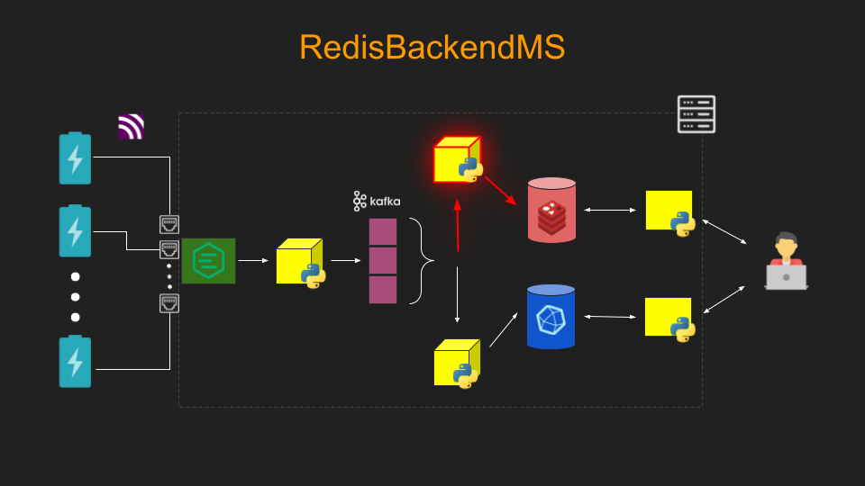

# RedisBackendMS

The **Redis Backend Microservice** plays a crucial role in data persistence and
notification within the EMS system. It consumes data from a designated Kafka
topic, processes and stores it in a Redis database, and ensures seamless
communication with downstream microservices.

When the data for a specific key in Redis is updated, this microservice
triggers a publish event to notify downstream services about the change.

## Key Responsibilities

1. **Data Consumption**: Listens to a Kafka topic and retrieves incoming data
   messages.
2. **Data Storage**: Processes the consumed data and stores it in the Redis
   database, ensuring efficient and reliable data persistence.
3. **Change Notification**: Publishes a notification event whenever a specific
   key in the Redis database is updated, facilitating real-time communication
   with downstream microservices.

Here is a visualization of the RedisBackendMS's role within the Pipeline
architecture:



## Installation

**Note**: This guide is for local installation. You may need `sudo`
privileges to execute some of these commands.

### Prerequisites

1. A Linux system (developed and tested on Ubuntu).
2. Kafka installed along with Zookeeper (comes with Kafka installation) and
   both Zookeeper and Kafka servers running locally.
3. Redis installed and active. You may need to adjust certain `redis.conf`
   files to add a password.
4. Docker installed and active.
5. A Python virtual environment:
    - Create and activate a virtual environment (`venv`).
    - Run `pipenv install` to install dependencies.
    - Run `pipenv install --dev` to install development dependencies.

### Environment Variables

Ensure in the root directory there is an `.env` file with the following
parameters:

```plaintext
# Kafka Configuration Settings
KAFKA_TOPIC=
KAFKA_BROKER=
KAFKA_GROUP=

# Redis Configuration Settings
REDIS_HOST=
REDIS_PORT=
REDIS_DB=
REDIS_PASS=
```

### Setup

- Make the CI/CD simulation script executable:
   ```bash
   chmod +x simulate_cicd.sh
    ```
- Run the simulation script to create Docker containers:
    ```bash 
    ./simulate_cicd.sh 3
    ```
  This will create and start 3 separate Docker containers.

**Note**: This script is intended to simulate a CI/CD deployment. The
actual `.github/workflows/deploy.yml` is simply a placeholder and would
be the next stage in the development process. Hence, this script will do
the following:

- stop and remove all previously running docker containers and images
  with the same name and prefix (ensures a clean build)
- lint the project in accordance with PEP 8 standards with `pylint .`
- run unit tests with `pytest -v`
- build the docker image
- then run X docker containers with that same image (meant to signify
  a scalable Microservice)

For the purpose of the demo, I figured simulating a CI/CD deployment
pipeline via bash script would be easier to show/explain in a
limited amount of time, especially since the Pipeline is intended to run
"on-premise".

### Teardown

- Make the teardown script executable:
  ```bash
  chmod +x teardown.sh
  ```
- Run the teardown script:

    ```bash
    ./teardown.sh
    ```

- This will simply remove any docker images and containers associated with
  this specific Microservice.

## Usage

- To view the logs of a running Docker container, e.g. the first one, use the
  following command:
  ```bash
    docker logs -f redis_backend_ms_simulation_container_1
    ```

**Note:** In a production environment, the logs would typically be redirected
to a
file and integrated with an ELK stack (Elasticsearch, Logstash, and Kibana) to
enable visualization and analysis on a dashboard. However, for the purposes of
this demo, I opted against introducing additional overhead to the Docker
container to minimize latency as much as possible.

## Testing

There is no need to explicitly run the linter or unit tests, since the
script `simulate_cicd.sh` already takes care of this.

## MIT License

Permission is hereby granted, free of charge, to any person obtaining a copy of
this software and associated documentation files (the "Software"), to deal in
the Software without restriction, including without limitation the rights to
use, copy, modify, merge, publish, distribute, sublicense, and/or sell copies
of the Software, and to permit persons to whom the Software is furnished to do
so, subject to the following conditions:

The above copyright notice and this permission notice shall be included in all
copies or substantial portions of the Software.

THE SOFTWARE IS PROVIDED "AS IS", WITHOUT WARRANTY OF ANY KIND, EXPRESS OR
IMPLIED, INCLUDING BUT NOT LIMITED TO THE WARRANTIES OF MERCHANTABILITY,
FITNESS FOR A PARTICULAR PURPOSE AND NONINFRINGEMENT. IN NO EVENT SHALL THE
AUTHORS OR COPYRIGHT HOLDERS BE LIABLE FOR ANY CLAIM, DAMAGES OR OTHER
LIABILITY, WHETHER IN AN ACTION OF CONTRACT, TORT OR OTHERWISE, ARISING FROM,
OUT OF OR IN CONNECTION WITH THE SOFTWARE OR THE USE OR OTHER DEALINGS IN THE
SOFTWARE.
